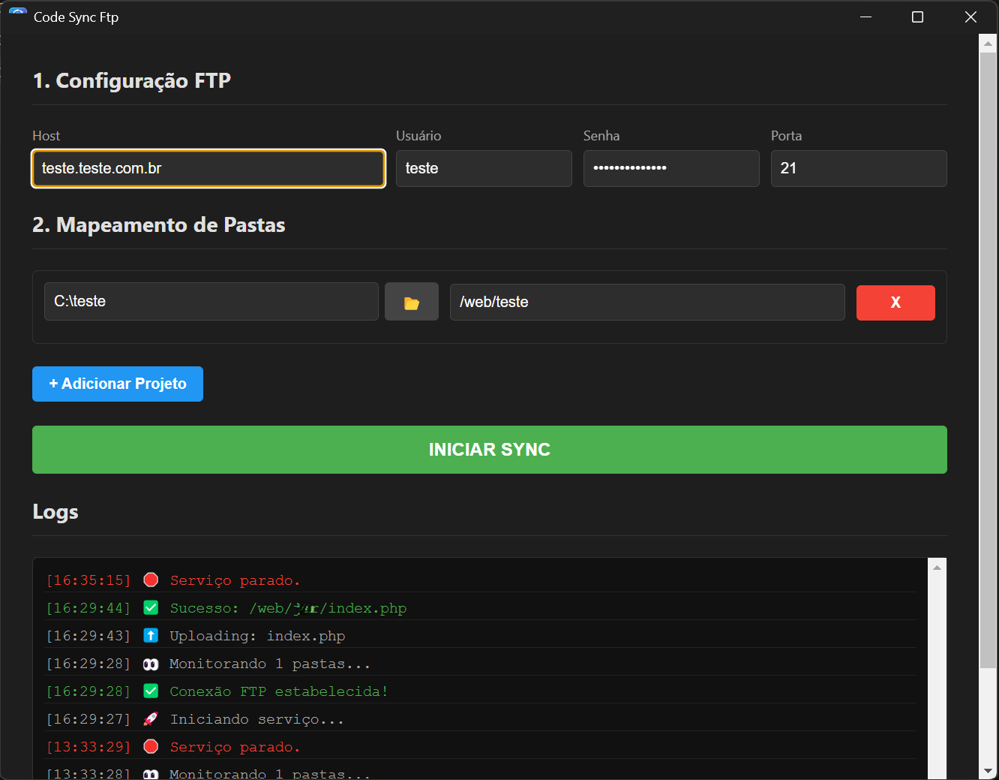

# 🚀 CodeSyncFtp

> Ferramenta de sincronização FTP automática, agnóstica a editor.
> **Versão Atual:** 1.3.0

O **CodeSyncFtp** é um aplicativo desktop leve que monitora pastas locais e faz upload automático de arquivos alterados para um servidor FTP. Foi criado para suprir a falta de sincronização robusta em editores como **Zed** e **Cursor**, mas funciona perfeitamente com **VS Code**, **Sublime Text**, **Notepad++** ou qualquer outro editor.



## ✨ Funcionalidades

- **Monitoramento em Tempo Real:** Criou, atualizou ou excluiu um arquivo? A alteração é refletida no servidor instantaneamente.
- **Minimizar para a Bandeja (Novo):** O aplicativo continua rodando em segundo plano (System Tray) mesmo ao fechar a janela. Controle o status pelo ícone próximo ao relógio.
- **Sincronização de Exclusão:** Se você deletar um arquivo ou pasta localmente, ele também será removido do servidor (Espelhamento real).
- **Multi-Projetos:** Gerencie múltiplos mapeamentos (Local ↔ Remoto) simultaneamente com regras independentes.
- **Cross-Platform:** Disponível para Windows e Linux.

## 📦 Instalação

Acesse a aba [Releases](https://github.com/edenilsonmota/code-sync-ftp-electron/releases) deste repositório e baixe a última versão:

- **Windows:** Baixe o arquivo `CodeSyncFtp Setup 1.3.0.exe`
- **Linux:** Baixe o arquivo `CodeSyncFtp-1.3.0.AppImage`

- **Linux:** Baixe o arquivo `CodeSyncFtp-1.3.0.deb`

## 🛠️ Como Usar

1. **Configuração FTP:** Preencha Host, Usuário, Senha e Porta.
2. **Adicionar Projeto:**
   - Selecione a **Pasta Local** no seu computador.
   - Digite o caminho da **Pasta Remota** no servidor (ex: `/public_html/site`).
3. **Iniciar:** Clique em **▶ INICIAR**.
4. **Trabalhar:** Abra seu editor favorito e comece a codar. O CodeSyncFtp fará o resto.
   > **Nota:** Ao clicar no "X" para fechar, o app será minimizado para a bandeja. Para sair totalmente, clique com o botão direito no ícone do relógio e escolha "Sair".

## 💻 Desenvolvimento (Rodar localmente)

Se você quiser clonar e editar o código fonte:

```bash
# Clone o repositório
git clone [https://github.com/edenilsonmota/code-sync-ftp-electron.git](https://github.com/edenilsonmota/code-sync-ftp-electron.git)

# Entre na pasta
cd code-sync-ftp-electron

# Instale as dependências
npm install

# Inicie em modo de desenvolvimento
npm start