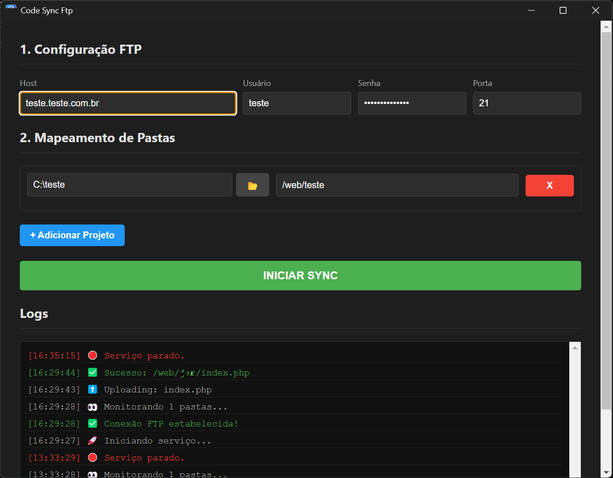

# 🚀 CodeSyncFtp

> Ferramenta de sincronização FTP automática, agnóstica a editor.
> **Versão Atual:** 1.3.0

O **CodeSyncFtp** é um aplicativo desktop leve que monitora pastas locais e faz upload automático de arquivos alterados para um servidor FTP. Foi criado para suprir a falta de sincronização robusta em editores como **Zed** e **Cursor**, mas funciona perfeitamente com **VS Code**, **Sublime Text**, **Notepad++** ou qualquer outro editor.



## ✨ Funcionalidades

- **Monitoramento em Tempo Real:** Criou, atualizou ou excluiu um arquivo? A alteração é refletida no servidor instantaneamente.
- **Minimizar para a Bandeja (Novo):** O aplicativo continua rodando em segundo plano (System Tray) mesmo ao fechar a janela. Controle o status pelo ícone próximo ao relógio.
- **Sincronização de Exclusão:** Se você deletar um arquivo ou pasta localmente, ele também será removido do servidor (Espelhamento real).
- **Multi-Projetos:** Gerencie múltiplos mapeamentos (Local ↔ Remoto) simultaneamente com regras independentes.
- **Cross-Platform:** Disponível para Windows, Linux e macOS.

## 📦 Instalação

Acesse a aba [Releases](https://github.com/edenilsonmota/code-sync-ftp-electron/releases) deste repositório e baixe a última versão:

- **Windows:** Baixe o arquivo `CodeSyncFtp Setup x.x.x.exe`
- **Linux:** Baixe o arquivo `CodeSyncFtp-x.x.x.AppImage` ou `CodeSyncFtp-x.x.x.deb`
- **macOS:** Baixe o arquivo `CodeSyncFtp-x.x.x.dmg`

## 🛠️ Como Usar

1. **Configuração FTP:** Preencha Host, Usuário, Senha e Porta.
2. **Adicionar Projeto:**
   - Selecione a **Pasta Local** no seu computador.
   - Digite o caminho da **Pasta Remota** no servidor (ex: `/public_html/site`).
3. **Iniciar:** Clique em **▶ INICIAR**.
4. **Trabalhar:** Abra seu editor favorito e comece a codar. O CodeSyncFtp fará o resto.
   > **Nota:** Ao clicar no "X" para fechar, o app será minimizado para a bandeja. Para sair totalmente, clique com o botão direito no ícone do relógio e escolha "Sair".

## 🐳 Desenvolvimento e Build (Docker Compose)

Este projeto usa Docker como forma principal de execução e build para Linux, macOS e WSL.

### Pré-requisitos

- Docker
- Docker Compose (`docker compose`)
- Linux desktop com servidor gráfico compatível (Wayland e derivados)

### Ícone de bandeja no GNOME

O Electron publica o ícone de bandeja no Linux pelo protocolo StatusNotifierItem. O GNOME Shell precisa de uma extensão que exiba esses indicadores. Em instalações Ubuntu nas quais ela não esteja presente ou habilitada, instale o suporte a AppIndicator:

```bash
sudo apt install gnome-shell-extension-appindicator
```

Depois, habilite a extensão **AppIndicator and KStatusNotifierItem Support** (ou **Status Icons**, no GNOME 50) e encerre/inicie novamente a sessão. Essa extensão é uma integração do ambiente gráfico; o pacote do CodeSyncFtp não deve ativá-la automaticamente no perfil do usuário.

### 1) Clonar o projeto

```bash
git clone https://github.com/edenilsonmota/code-sync-ftp-electron.git
cd code-sync-ftp-electron
```

### 2) Rodar o app em modo desenvolvimento (GUI)

Suba o serviço de desenvolvimento:

```bash
docker compose --profile dev up --build app-dev
```

### 3) Buildar instaladores Linux

```bash
docker compose --profile build run --rm app-build
```

Os artefatos serão gerados em `dist/` no diretório do projeto, incluindo:

- `CodeSyncFtp-<versao>.AppImage`
- `code-sync-ftp_<versao>_amd64.deb`
- `code-sync-ftp-<versao>-1-x86_64.pkg.tar.zst` para Arch Linux

### 4) Buildar ou rodar no Windows (local)

```bash
npm install
npm start
npm run dist -- --win
```

No Windows, use fluxo local com npm (sem Wine em Docker).

> ⚠️ No Linux/WSL, o build para Windows requer o Wine instalado. Se você estiver em um ambiente Linux/WSL e não quiser instalar Wine, execute esse comando em uma máquina Windows nativa.

### 5) Buildar instalador Windows via Docker

```bash
docker compose --profile build-win run --rm app-build-win
```

Esse profile usa um target Docker separado com Wine e não altera o build Linux.

### 6) Limpeza opcional

```bash
docker compose down -v
```

> Observacao: o fluxo em Docker deste repositório e voltado para Linux, macOS e WSL.

## 🙏 Agradecimentos

Projeto criado por [Edenilson Mota](https://github.com/edenilsonmota). Se esta ferramenta foi útil para você, considere apoiar o desenvolvedor.
