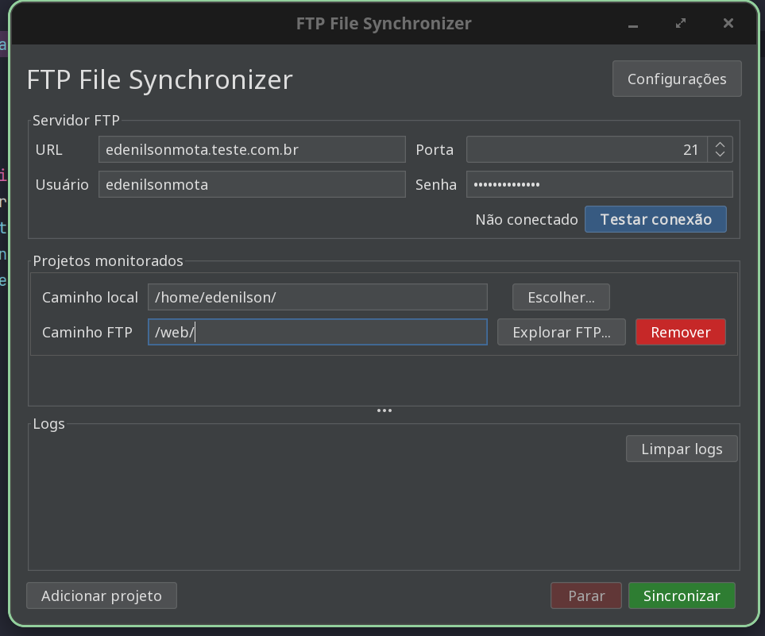

# FTP File Synchronizer

Aplicativo desktop para acompanhar alterações em pastas locais e enviá-las
automaticamente para um servidor FTP.



Criei este projeto para substituir o sincronizador que eu usava no Electron por
uma aplicação Java mais leve e independente de editor ou IDE.

## O que já funciona

- conexão com servidor FTP;
- vários projetos locais apontando para caminhos FTP diferentes;
- envio de arquivos criados ou alterados enquanto o monitoramento está ativo;
- exclusão remota quando um arquivo local é removido;
- fila de upload com envio de um arquivo por vez;
- agrupamento de alterações rápidas no mesmo arquivo;
- escolha entre tema claro e escuro e ajuste do tamanho da fonte;
- armazenamento das configurações e proteção da senha pelo cofre do sistema.

O programa não envia o projeto inteiro quando o monitoramento começa. Ele cuida
somente das alterações que acontecerem depois de clicar em **Sincronizar**.

## Rodando pelo código-fonte

Você precisa do JDK 25. O Maven já é baixado pelo wrapper do projeto.

Linux ou macOS:

```bash
./mvnw clean package
java -cp "target/jpackage-input/*" com.edenilson.ftpsync.app.Main
```

Windows:

```powershell
.\mvnw.cmd clean package
java -cp "target\jpackage-input\*" com.edenilson.ftpsync.app.Main
```

Também é possível executar a classe `com.edenilson.ftpsync.app.Main` diretamente
pelo IDEA.

## Gerando instaladores

Os comandos de empacotamento para Linux, Windows e macOS estão no
[BUILD.md](BUILD.md).

## Observação

O FTP comum não criptografa a conexão. Por enquanto este projeto deve ser usado
somente com servidores e redes confiáveis.

Projeto criado por [Edenilson Mota](https://github.com/edenilsonmota).
